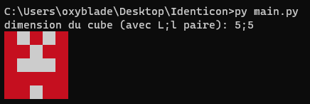
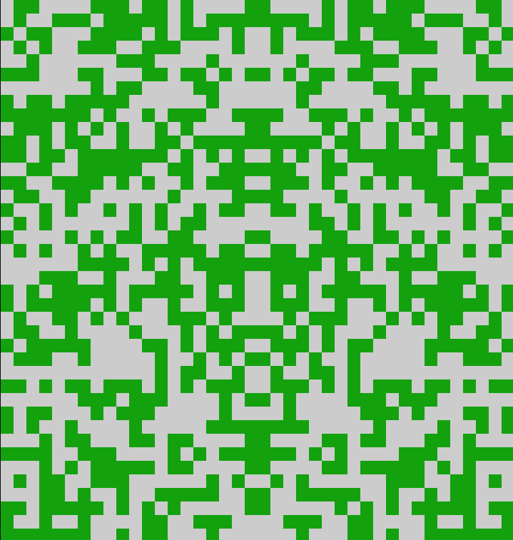

# Identicon

" Projet encore en développement "

> Qu'est ce qu'un Identicon
Un Identicon; Est une photo de profil qui vous est attribuer lorsque vous rejoignez pour la première fois Github. Pour eviter que tout le monde est la même photo de profil. Intéressé par le fonctionnement de ce genre d'image. Je décide d'encréer une à mon tour.

> Principe du projet

Générer une image en entrant les dimensions vouluent
et qui en sortie, renvoie le rendu de l'image (pour que l'utilisateur puisse la changer si il ne l'aime pas) et la télécharge des que le resultat est bon.

> Interface actuelle

> Partie Algorithmique
Pour pouvoir construire une image qui a une forme aléatoire
Je dois faire en sorte d'éparpiller sur une matrice des nombre entre `1` et `0` aléatoirement.

0 1 0 1
0 0 1 0
1 0 1 0
0 1 0 1

De plus, comme on essaye de faire des forme de personnage pixelisé on doit ajouter une symétrie ce qui au finale me permet d'obtenir des résultat incroyable et qui repondent au goût et couleur de chacun

> Prérequis

Aucune installation de librairie particulière or mit du python
-> Release à venir ainsi qu'une interface plus userFriendly :)